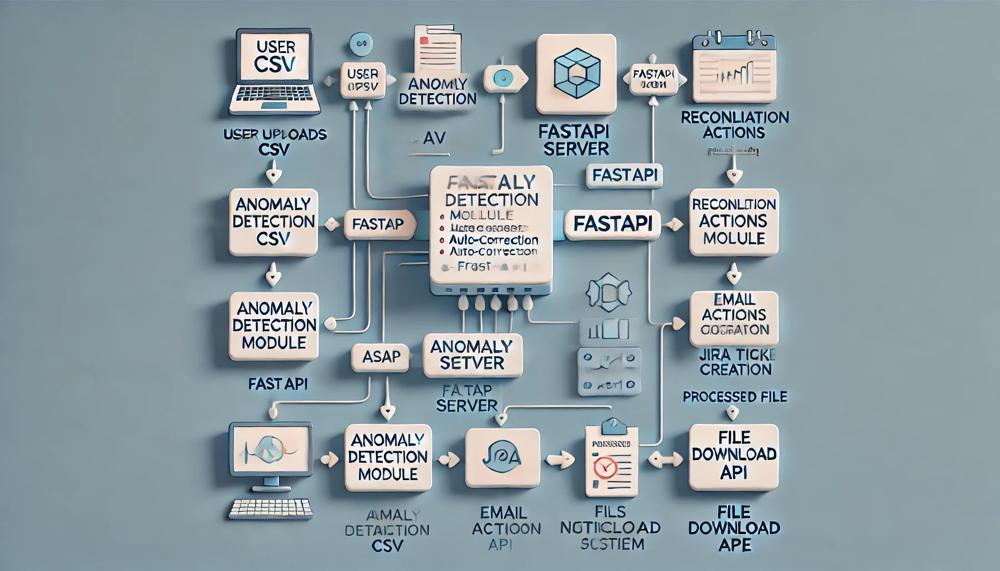

                  +----------------------------------+
                  |          User / Client          |
                  +----------------------------------+
                                |
                                | 1️⃣ Uploads CSV file (HTTP POST)
                                v
                  +----------------------------------+
                  |         FastAPI Service         |
                  |    (app.py - Uvicorn Server)    |
                  +----------------------------------+
                                |
        +-------------------------------------------------+
        |                 API Endpoints                  |
        |  - /detect_anomalies/ (POST)                   |
        |  - /download/{filename} (GET)                 |
        +-------------------------------------------------+
                                |
                                v
         +------------------------------------------------+
         |      Anomaly Detection & Data Processing       |
         |  - Reads CSV file using Pandas                |
         |  - Compares real-time data with historical    |
         |  - Identifies anomalies using AI model        |
         |  - Generates a processed file with anomalies  |
         +------------------------------------------------+
                                |
               +---------------------------------+
               |        Reconciliation Actions  |
               |  - Cross-check Source Systems  |
               |  - Auto-fix minor discrepancies |
               |  - Create JIRA Tickets         |
               |  - Send Email Notifications    |
               +---------------------------------+
                                |
             +----------------------------+
             |  📩 Email Notification      |
             |  - Sends processed CSV file |
             |  - Notifies relevant teams  |
             +----------------------------+
                                |
                                v
                  +-------------------------+
                  |  User Downloads Processed |
                  |     CSV File via API      |
                  +-------------------------+

### Components Explained:

##### **1️⃣ User / Client:**

Uploads a reconciliation CSV file.
Can download the processed file after anomalies are detected.

##### **2️⃣ FastAPI Service (app.py - Uvicorn Server):**

Exposes REST API endpoints for uploading & downloading files.
Runs an anomaly detection process when a file is uploaded.

##### **3️⃣ Anomaly Detection & Data Processing:**

Uses Pandas to read CSV data.
Identifies anomalies by comparing real-time data with historical baselines.
Appends columns: Anomaly (True/False), Reason, Recommended Action.

##### **4️⃣ Reconciliation Actions:**

Logs anomalies for human review.
Auto-corrects minor issues where possible.
Creates JIRA tickets or sends notifications for critical anomalies.

##### **5️⃣ Email Notification:**

Sends an email with the processed CSV file attached.
Alerts concerned teams about detected anomalies.

##### **6️⃣ File Download API:**

Users can download the processed file with anomaly details.

## **visual diagram of this architecture:**

### **Summary of the Flow**:

📤 User uploads CSV → 🔄 AI detects anomalies → 🔧 Reconciliation actions applied → 📄 Processed file is generated → 📩 Email with attachment sent → ⬇️ Users can download the file